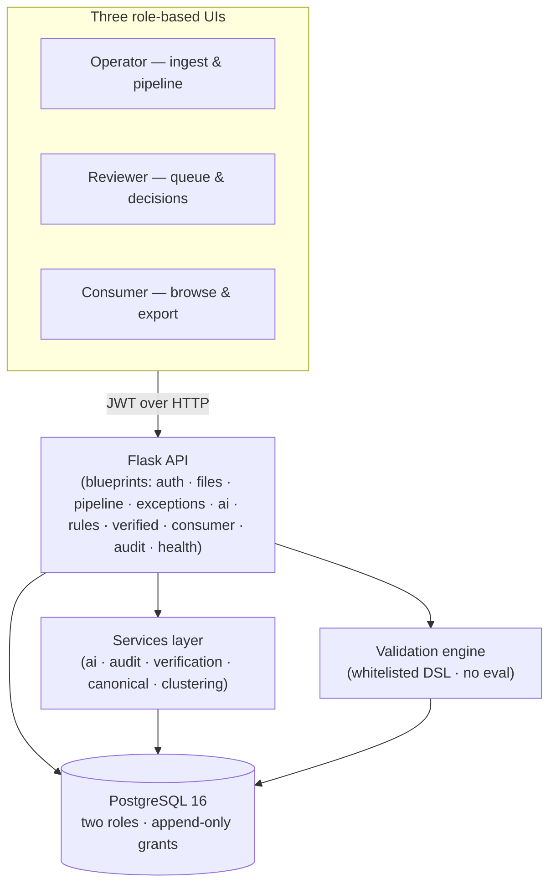
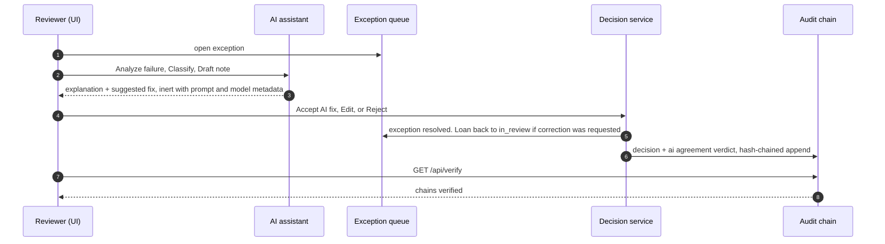

# TrueTape — Architecture Note

**Intain Campus FinTech Challenge 2026 · Full Stack Track**

This note explains *why* the system is shaped the way it is. The one-line summary:
**a layered, feature-first Python/React application whose interesting decisions are all
about integrity** — who may write what, how every change is provably recorded, and how
an AI assistant helps without ever touching data.

---

## 1. System overview


*Renders on GitHub; the same diagram in ASCII lives in the README's pipeline section.*

- **Frontend** — React 19 + Vite + TanStack Query. The View layer lives entirely here;
  the backend is a JSON API, which is why the backend does not use classic MVC
  (see §3).
- **Backend** — Flask blueprints (presentation) → services (domain logic) → SQLAlchemy
  models (data). Feature packages (`auth/`, `ingestion/`, `exceptions/`, `validation/`)
  own their routes; `api/` holds cross-cutting aggregates that span features
  (consumer browser, pipeline trigger, AI actions over exceptions, rules).
- **Database** — PostgreSQL 16 with a two-role, least-privilege grant model (§4).

## 2. The pipeline — five stages, five code homes

```mermaid
flowchart LR
    UP["Upload CSVs<br/>(operator, POST /api/files)"] --> P1["Stages 1–2<br/>parse + normalise"]
    P1 -->|"raw_records → versioned loan_records"| P3["Stage 3<br/>validate: row · dataset · cross-source"]
    P3 -->|"validation_results + exceptions"| P4["Stage 4<br/>canonical blend by field trust"]
    P4 -->|"loan_canonical + pinned fields"| P5["Stage 5<br/>cluster by root cause"]
    P5 -->|"exception_clusters"| REV["Reviewer<br/>(AI assist · accept / edit / reject)"]
    REV -->|"decisions (hash-chained)"| VER["Verify<br/>(no open blocking exceptions)"]
    VER -->|"verified_record + trust score"| CON["Consumer<br/>(browse · provenance · export)"]
    P1 -->|"unreadable rows quarantined"| EXC["import_error exceptions"]
    EXC --> REV
```


*Stages 1–2 run automatically per upload; stages 3–5 run as one atomic `run-pipeline` command.*

| Stage | What happens | Code | Trigger |
|---|---|---|---|
| 1. Parse | CSV → `raw_records`, byte-faithful, with per-row parse errors | `ingestion/service.py` | automatic on upload (worker thread) |
| 2. Normalise | raw rows → versioned `loan_records` + canonical `loans`; unreadable rows quarantined as `import_error` | `ingestion/normalizer.py` | automatic (same worker) |
| 3. Validate | row-scope rules (B1), dataset-scope rules (B2), cross-source conflicts (B3) → `validation_results` + exceptions | `validation/runner.py` (+ `validation/dsl.py`) | `flask run-pipeline` / `POST /api/pipeline/run` |
| 4. Canonical blend | per-field survivorship across sources by trust → `loan_canonical` (the per-field trust table is defined in §6.1) | `services/canonical.py` | same |
| 5. Cluster | open exceptions grouped by root cause → `exception_clusters` | `services/clustering.py` | same |

Stages 1–2 run per upload; 3–5 run as **one atomic command** (`run-pipeline`,
`make validate`) — a single commit, so a failed stage leaves nothing half-written.
Force re-runs preserve every reviewer decision and every AI-pinned exception, and
skip re-creating decided defects.

## 3. Why not MVC

Classic MVC assumes server-rendered views. TrueTape is a JSON API plus a React SPA:
the View lives in the frontend, so an MVC split would only rename folders. The codebase
is instead a **layered, feature-first architecture** with two explicit rules:

1. **Feature packages own their CRUD routes** (`auth/`, `ingestion/`, `exceptions/`,
   `verification` via its API module).
2. **`api/` holds cross-cutting aggregates** that span features — the consumer browser,
   the pipeline trigger, the audit queries, AI actions that operate *over* exceptions.

The pipeline stages span three packages by design: each stage is a bounded context
(parsing is not validation is not survivorship), and the stage order lives in one place
(`cli.run-pipeline` / `api/pipeline.py`) rather than distributed across the packages.

## 4. Integrity model — the decisions that matter

### D1 · Two-role Postgres, enforced at the database

`truetape_owner` owns tables and runs migrations; the Flask app connects as
`truetape_app`, which owns nothing and holds only SELECT/INSERT/UPDATE/DELETE.
`harden-db` then **revokes UPDATE/DELETE/TRUNCATE** on the append-only tables
(`audit_events`, `ai_recommendations`, `raw_records`, `loan_records`,
`verified_records`). Three layers, each catching what the previous one cannot:

| Threat | Caught by |
|---|---|
| A bug in application code rewrites history | DB grants — the statement fails |
| A developer bypasses the ORM with raw SQL | DB grants — same |
| A superuser rewrites history | the hash chain — verification fails |

### D2 · Append-only hash chains

`audit_events` is one global chain; `verified_records` are chained **per loan**.
Every event's hash is SHA-256 over a canonical (key-sorted) JSON envelope of
`_HASH_FIELDS` — including `ai_metadata`, so AI provenance is folded into the
tamper evidence. Appends serialise on `pg_advisory_xact_lock` so two workers cannot
read the same tip and fork the chain; `verify_chain()` re-walks every link and is
exposed at `GET /api/verify` (the "✓ hash chains verified" badge).

### D3 · A validation DSL that cannot execute code

Rules are JSON trees over a **whitelisted node vocabulary** (`and/or/not/comparison/
func/literal/field/context`) — nothing is ever `eval`'d, which is the entire security
argument for AI-authored rules. Two semantics make the engine honest:

- **Conditions are PASS predicates** — a rule's tree states when a record is fine;
  the complement is the exception. The NL-rule compiler translates the reviewer's
  violation phrasing into its complement ("rate above 36" → `interest_rate <= 36`).
- **Three-state results** — `pass` / `fail` / `not_applicable` (an `ABSENT` sentinel
  with Kleene logic for and/or). Only pass/fail enter trust-score denominators, so a
  blank manifest cell can never fabricate a failure.

### D4 · Canonical blending with human precedence

`loan_canonical` picks each of the 21 fields from the source with the highest
field-level trust. Reviewer edits **pin** a field (source `human_override`, trust 100)
and append an `origin='human_edit'` revision to `loan_records` — lineage is append-only,
so "what did ServicerX originally say" is a one-line query. The corrected value is
re-validated like an import: a bad correction opens a *new* exception instead of being
trusted.

### D5 · A deterministic AI that knows when it has nothing

The review assistant is provider-agnostic (`AI_PROVIDER=deterministic|groq`), but three
properties hold regardless of provider:

- **Confidence is computed by the backend** from observable factors (exception type,
  severity, field impact, evidence coverage, completeness) — never self-reported.
- **Suggestions come from data**: cross-source conflicts resolve to the most-trusted
  source's value with attribution; when every source repeats the failing value the
  engine says **"no valid alternative — manual correction required"** instead of
  recommending the bug as its own fix.
- **Recommendations are inert.** Only a human `ReviewerDecision` mutates canonical
  data; the decision records which recommendation it responded to and whether the
  reviewer agreed.

### D6 · Decision semantics

`resolve` supports accept / edit / manual_resolution / reject (+ `request_correction`,
which bounces the loan to `in_review` and writes a `correction_requested` audit event).
The resolve form is coupled to the AI: **Accept AI fix** pre-fills the correction and
records agreement; **Dismiss** records disagreement. Force re-runs preserve decisions
and AI-pinned exceptions, and skip re-creating decided defects (the append-only grant
on `ai_recommendations` enforces the same preservation at the database level).

### D7 · Cluster-first queue with explicit counting semantics

Exceptions cluster by root cause (rule code; rule-less types cluster separately), so
one systematic defect is one card. The engine deliberately surfaces **more** than the
215 seeded oracle findings: duplicate rules flag every offending row, servicer mirror
rows are validated, clones inherit defects. `flask reconcile-oracle` machine-checks
every delta into a named bucket (§5) rather than pretending engine and oracle counts
must match.

### D8 · Concurrency

Three locks, three scopes: the audit chain (global transaction-scoped lock), per-loan
verification (advisory lock keyed by loan — unrelated loans verify in parallel), and
file ingestion (a **dedicated-connection** session lock serialising whole-file
processing; a session-level lock fails here because the ORM returns connections to the
pool after every commit — learned live, see `docs/AI_DEV_LOG.md` #8).

### D9 · Frontend discipline

One shared formatting module (`lib/format.js`) routes every displayed value — no raw
keys or `[object Object]` anywhere. The reviewer resolve form is coupled to the AI
suggestion (one-click accept, recorded agreement), and every page has designed empty,
loading and error states.

## 5. The review loop — AI controls in one picture



Every AI output is separate from every human decision, metadata is hashed into the
chain, and no AI output mutates data — the only writer is the reviewer's decision.

## 6. Scoring & decisioning — the three numbers, defined

### 6.1 Trust score (0–100, computed at verify)

```
score = 0.40 · validation_pass_rate
      + 0.30 · exception_health
      + 0.15 · source_coverage
      + 0.15 · source_trust_average
```

The first two factors are **severity-weighted** (`LOW 1 · MEDIUM 2 · HIGH 4 ·
CRITICAL 8`), so a CRITICAL pass or resolution moves the score eight times as far
as a LOW one:

| Factor | Formula | Note |
|---|---|---|
| Validation pass rate (40%) | `w_pass / (w_pass + w_fail) × 100` | not-applicable checks are excluded — a blank cell cannot fabricate a failure; no results at all → 0, not 100 |
| Exception health (30%) | `w_resolved / w_total × 100` | "resolved" = a reviewer acted (accept / edit / manual / reject) |
| Source coverage (15%) | `distinct non-human sources / 3 × 100` | reviewer overrides are excluded — corroboration must come from independent systems |
| Source trust (15%) | `mean(trust of winning source per field)` | averages how authoritative each canonical field's source is |

**The guardrail:** a loan with **no validation evidence** is capped at **25 / 100**
(`if not has_validation_evidence and score > 25 → 25`). Provenance alone cannot
certify an unchecked loan.

**Per-field provenance policy** (the trust table that decides which source wins each
field — data in `trust_config.json`, not code): original_principal → OriginationCore 90
/ Servicer 60; current_balance, payment_status, days_past_due → Servicer 92 / Origination
55; document_status → Manifest 95; a reviewer override pins the field at 100, outranking
every machine source. Origination is authoritative at closing, the servicer owns
post-boarding movement, the manifest owns documents.

### 6.2 AI confidence (0.38–0.92, computed at review)

```
confidence = 0.25 + type + severity + impact + evidence + completeness      (clamped 0–1)
```

| Component | Range | Rationale |
|---|---|---|
| Base | 0.25 | fixed floor for any recommendation |
| Exception type | 0.04–0.13 | conflicts are easier to reason about than import errors |
| Severity | 0.02–0.07 | higher-severity findings carry more signal |
| Field impact | 0.04 / 0.10 | financially material / identity fields weigh more |
| Evidence | 0.03–0.22 | more corroborating sources → more confidence |
| Completeness | 0.00–0.15 | canonical + source values present |

Computed by the backend from the exception's observable properties — the assistant
cannot inflate its own confidence. **The ceiling is 0.92 by construction: the model is
never allowed to claim certainty** (never 1.00). Worked example — a HIGH source_conflict
on `current_balance` corroborated by two sources: 0.25 + 0.13 (type) + 0.05 (severity)
+ 0.10 (impact) + 0.22 (evidence) + 0.15 (completeness) = **0.90**.

### 6.3 Triage priority — three coordinated signals

There is no `priority` column. What a reviewer works first emerges from:

1. **Severity rank** — `SEV_ORDER`: CRITICAL > HIGH > MEDIUM > LOW.
2. **The blocking gate** — `is_blocking = severity ∈ {HIGH, CRITICAL}`; blocking
   exceptions prevent verification, LOW/MEDIUM may stay open.
3. **Cluster ordering** — clusters are ordered by open count, so the biggest systematic
   defect surfaces first and can be cleared in one action.

### 6.4 Advisory severity re-check (`classify_severity`)

The assistant independently reviews each rule-assigned severity, stored beside it in
`ai_severity` (never overwriting the rule's call — the agreement rate is therefore
computable):

- **Material field** (financial / identity / dataset-structural) → *severity stands*.
- **Non-material HIGH / CRITICAL** → *eased exactly one level, floored at MEDIUM* — a
  serious defect is never dropped to trivial.
- **Low-impact LOW / MEDIUM** → no change.

Advisory only: the recommendation is inert, and only a human decision can act on it
(hash-chained, like every decision).

### 6.5 Eligibility vs trust score — kept distinct

**Eligibility is a binary gate** (no open blocking exceptions). **The trust score is a
0–100 quality measure** minted once a loan passes that gate. A loan can be eligible yet
score modestly — the gate asks "may we certify it?", the score asks "how much evidence
backs the certification?".

## 7. Oracle reconciliation (engine 230 vs oracle 215)

The provided oracle lists deliberately injected defects. The engine is a **superset**;
`flask reconcile-oracle` matches oracle rows to engine findings and buckets every
delta (exit non-zero on anything unexplained):

| Delta | Count | Bucket |
|---|---|---|
| `DUPLICATE_LOAN_ID` / `…FINGERPRINT` extras | +11 | per-row counting: every member of a duplicate group is flagged, the oracle logs one row per seeded defect |
| `CLOSED_LOAN_ZERO_BALANCE` / `NON_NEGATIVE_BALANCE` / `VALID_PAYMENT_STATUS` extras | +6 | servicer mirror rows carry the same defect — the engine validates every source, the oracle logs only the tape |
| `CURRENT_BALANCE_LE_ORIGINAL_PRINCIPAL` extra | +3 | fingerprint-clone rows inherit the donor's defect |
| source_conflict missed | −6 | generator clamped the servicer delta onto an equal value (closed/zero loans) — undetectable by design |
| source_conflict extra | +1 | overlapping tape defect is a real disagreement the oracle books elsewhere |
| import_error | 4 ✓ | — |

**RESULT: PASS** — zero unexplained deltas.

## 8. Data model (16 tables, the spine)

```
users ── raw_files ── raw_records ── loan_records (versioned per source,
                                          append-only) ──┐
loans ── loan_canonical (blended + pinned fields)         │
  │                                                       │
  ├── exceptions ── exception_clusters                    │
  │      ├── ai_recommendations (append-only)             │
  │      ├── exception_comments                           │
  │      └── reviewer_decisions ──────────────────────────┘
  ├── validation_results ── validation_rules (18 seeded, versioned)
  └── verified_records (per-loan hash chain, append-only)

audit_events (global hash chain, append-only) · trust/source config tables
```

## 9. Deployment shape

Docker Compose (db + API + frontend) is both the development and the deployment
artifact. On EC2 free tier the same compose runs unchanged with committed seed data
(`data/seed` is part of the deployment contract — `flask seed` reads it from the
mounted volume) and `VITE_API_URL` pointed at the host.

## 10. What we would do next

- **Vertical slices**: promote `verification` and `consumer` from `api/` modules into
  feature packages owning models + routes + service (the current layout is one
  mechanical step away).
- **A real LLM provider** slots into `services/ai.py`'s seam — the confidence, audit
  and UI contracts stay identical; only the text generation changes.
- **Auto-stale detection** for the pipeline: re-run validation automatically when new
  `loan_records` postdate the last run (today it is an explicit `--force`).
- **Signed exports**: the CSV/JSON export could carry the verified-record hashes for
  end-to-end consumer verification.
